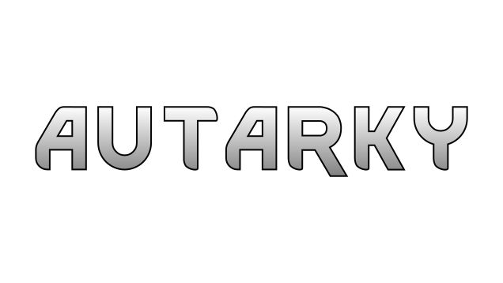

# Autarky Rimworld Mod
Are you sick of waiting for the trader that never comes?
Or didn't he have any Neutroamine and now you're stuck with
herbal medicine?
Couldn't get any Luciferium for your bionically improved brawler?

Now you can help yourself. Boomalopes and Boomrats are no longer only annoying bombs
walking around, but produce useful resources that can be used to synthesise Neutroamine and
extract Devil's Dust from Devilstrand. I'll leave the rest for you to discover.

# Acknowledgement
This is my first mod for RimWorld and it was created in about a week, not least thanks to the
kind people in [#rimworld-modding](https://discord.gg/0kEwljX6FiCur2uN). Especially I want to thank erdelf, NotFood, Mehni, ChJees, spdskatr, Swenzi, Xen, Why_is_that, Alistaire and probably other whom I forgot. So thank you. Without this wouldn't have been done in so little time.  
And also thank you to Marnador for his RimWorld Font.
